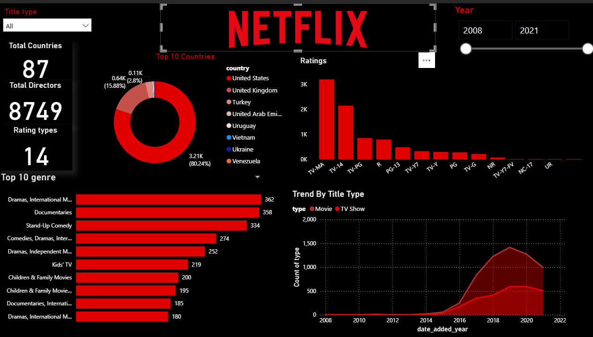

# 🎬 Netflix Data Analysis and Visualization

Analysis of Netflix content added between **2008 and 2021** to understand content type, genres, countries and ratings, using PostgreSQL, Python and Power BI.

**Jump to:** [Dashboard](#-dashboard) • [Key Insights](#-key-insights) • [Try It Yourself](#-try-it-yourself) • [Tools](#-tools-used) • [Data Cleaning](#-data-cleaning) • [Files](#-files)

---

## 📊 Dashboard

| Total Countries | Total Directors | Rating Types |
|:---:|:---:|:---:|
| **87** | **8,749** | **14** |

---

## 💡 Key Insights

| # | Insight |
|---|---|
| 1 | **Movies outnumber TV Shows every year.** Movie additions peaked at about 1,400 titles in 2019, against about 600 for TV Shows. |
| 2 | **Content additions grew sharply after 2015** and peaked around 2019. |
| 3 | **Drama and documentary lead the genres:** Dramas, International Movies (362), Documentaries (358) and Stand-Up Comedy (334). |
| 4 | **Netflix leans towards mature audiences.** TV-MA is the most common rating (about 3.2K titles), followed by TV-14 (about 2.1K). |
| 5 | **The United States leads the country chart** with 80.24% of the Top 10 Countries chart, followed by the United Kingdom with 15.88%. |

<b>Click to see the dashboard visuals</b>

- **Trend By Title Type:** area chart of Movies vs TV Shows added per year
- **Top 10 genre:** bar chart of the most frequent genres
- **Top 10 Countries:** donut chart of content by country
- **Ratings:** bar chart across 14 rating types
- **Slicers:** Title type and Year range

---

## 🖱️ Try It Yourself

The dashboard is interactive. After opening it in Power BI Desktop:

1. Use the **Title type** dropdown to switch between Movies and TV Shows.
2. Drag the **Year** slider to focus on any period between 2008 and 2021.
3. Click a bar or slice to filter every other chart.

**To open it:** download `netflixreport.pbix` from this repo and open it in Power BI Desktop.

---

## 🛠️ Tools Used

| Tool | Used for |
|---|---|
| PostgreSQL | Data cleaning |
| Python (Pandas, Matplotlib, Seaborn) | Exploratory data analysis |
| Power BI | Interactive dashboard |

---

## 🧹 Data Cleaning

<b>Click to see the cleaning steps</b>

1. Treated null values
2. Removed duplicates
3. Populated missing rows
4. Dropped unnecessary columns
5. Split columns where needed

---

## 📁 Files

| File | Contents |
|---|---|
| `netflixreport.pbix` | Power BI dashboard |
| `Netflix Data Analysis and Visualization.pdf` | Full project report |
| `netflix-dashboard.png` | Dashboard screenshot |

---

## 📂 Dataset

Cleaned version of the Netflix dataset from Kaggle:(https://www.kaggle.com)
